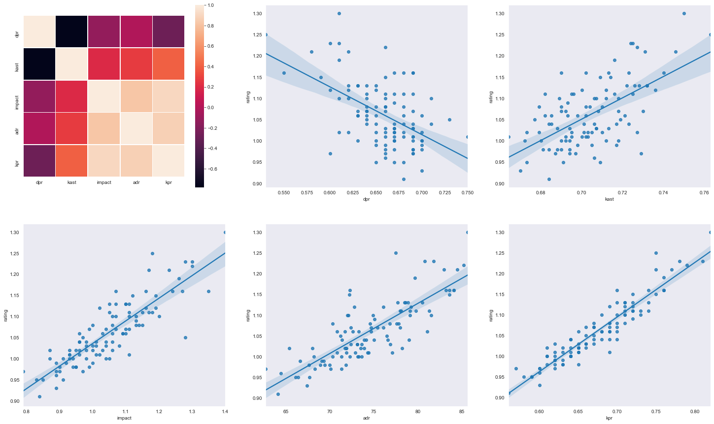

# HLTV 2.0 Players Rating

Model created to predict the HLTV (https://hltv.org) CS:GO players rating using the matchs stats.

Score: 99.77%
    
## Train

Execute the following command to train the model:

    python train.py 

The training data are on the file *stats.csv*, where:

    - rating: HLTV 2.0 rating     
    - dpr: Deaths per round
    - kast: Percentage of rounds in which the player either had a kill, assist, survived or was
      traded.
    - impact: Measures the impact made from multikills, opening kills,and clutched.
    - adr: Average damage per round. 
    - kpr: Kills per round.

## Predict

Execute the following command:

    python predict.py dpr kast impact adr kpr

Help command:

    python predict.py --help
